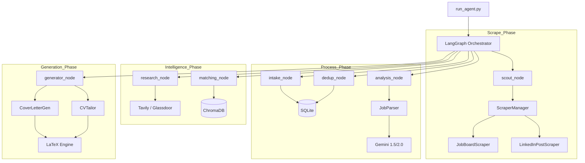

# System Architecture Overview

## Data Flow Diagram

## Key Components

### 1. LangGraph Pipeline
The core "brain" of the system. It handles the 11-node state machine, retries, and routing.

### 2. JobParser (Phase 4)
The extraction engine. It takes raw text and produces valid JSON matching the `ParsedJob` schema.

### 3. ScraperManager (Phase 2 & 3)
Orchestrates multiple scraping sources, merges results, and applies deduplication via SHA-256 fingerprints.

### 4. VectorStore (Phase 5 & 6)
Indexes the user's GitHub repos and CV projects into ChromaDB for semantic matching against job descriptions.

### 5. LaTeXEngine
A Jinja2-powered template engine that produces professional PDF documents from AI-generated content.
